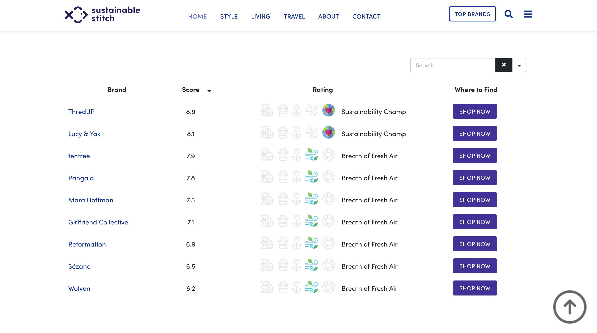

# Environmental Impact Assessment Model

## **Overview**

Existing sustainability ratings in the apparel industry frequently lack methodological consistency and rely heavily on qualitative assessments. This project aims to establish a more standardized, data-driven approach.

This Environmental Impact Assessment Model is a data-driven framework that I designed to estimate and quantify the environmental footprint of apparel brands using a transparent, evidence-based approach. It leverages lifecycle assessment (LCA) data, biostatistical scoring, and ecological health principles to rate brands more objectively.

The heart of this project is the Sustainable Stitch Rating System, a model built in Excel that allows for reproducibility, transparency, and scalability. The final outputs are published and visualized on sustainablestitch.co, a platform I created to make sustainability scores accessible and easy to interpret for everyday consumers.

## **The Motivation**

Clothing production is a major driver of global emissions, responsible for up to 10% of annual carbon output. Recognizing the environmental and public health impacts of overconsumption, I aimed to develop a practical framework that helps connect consumer choices with broader sustainability outcomes. The apparel industry is not only a contributor to ecological degradation but also indirectly affects public health via air pollution, water contamination, and unsustainable labor practices.

Yet, most consumer-facing sustainability guides lack data integrity and consistency. My goal was to develop a replicable and evidence-backed method that empowers shoppers to make informed choices–ones that align with their values, not just marketing claims.

## **Methodology**

### 1. Lifecycle Assessment of Common Fibers

I began with a systematic review of the environmental life cycle assessments (LCA) of 36 of the most commonly used fabrics in the apparel industry. These materials, ranging from conventional cotton to lyocell to recycled polyester, were evaluated based on their impact on carbon emissions, water usage, waste generation, land degradation, and energy consumption.

This literature review process was modeled after standard research protocols: establishing inclusion/exclusion criteria, identifying reputable data sources, and applying a consistent scoring rubric. Each fabric was then assigned a percentile-based score based on its environmental burden.

<!DOCTYPE html>
<html>
<body>
  

  
  </script>
</body>
</html>

### 2. Creating the Sustainable Stitch Rating System

Using the results from the LCA review, I developed a weighted environmental scoring system to reflect the relative impact of each stage in the apparel supply chain. The weighting was based on emissions data from the _2020 McKinsey & Company and Global Fashion Agenda_ report. The final score incorporates the following distribution:

* Fabric and fiber production – 80%
* Assembly – 12%
* Distribution – 4%
* End-of-life – 4%

Each component of the score was developed using a mixture of primary and secondary data collection, scored using transparent rules. The final sustainability score was then translated into a five-tier rating called the Sustainable Stitch Rating, where each tier reflects a brand's relative environmental performance.

## **Data Collection**

I compiled data from a wide array of publicly available sources:
* Brand websites and product catalogs
* Corporate social responsibility (CSR) reports
* Press releases and news features
* Interviews with senior management
* Social media statements
* Third-party sustainability reports

In instances where data were unavailable or unclear, I contacted brands directly for clarification, documenting their responsiveness as part of a transparency score.

## **Catalog-Level Fabric Analysis**

To assess how brands source and use fabric, I conducted a detailed audit of product catalogs, analyzing thousands of listings to extract fabric type information. I performed a complete count of product listings for brands with a manageable number of items. For brands with a more sizable collection, I calculated the appropriate sample size based on the total number of products in their catalog. This approach maintained the statistical strength of the analysis while ensuring the data remained both representative and feasible to process.

The process combined manual review with automated scraping techniques, allowing me to quantify each brand’s fabric footprint with a high degree of accuracy.

## **Fabric Assessment**

The Fabric Assessment Score reflects the environmental burden of the raw materials used by each brand. This metric was derived by cross-referencing the fiber content of a brand’s products with the LCA-based scores from my research. Each fabric type was assigned a percentile score, and a brand’s overall fabric score was computed as a weighted average based on usage.

For example, a brand using a majority of recycled polyester and lyocell would score significantly higher than one relying heavily on conventional cotton or virgin polyester.

## **Brand Transparency**

Transparency is a key indicator of a clothing brand’s commitment to environmental responsibility. Openly communicating sustainability efforts helps build public trust, encourages accountability, and empowers consumers to make informed choices.

In this assessment, transparency was treated as a proxy for accountability. Brands that provided clear, accessible environmental information, acknowledged areas for improvement, and demonstrated a willingness to engage with sustainability topics received higher scores. In contrast, brands that lacked publicly available data or made vague, unverified sustainability claims received lower evaluations in this category.

## Additional Assessment Criteria
Beyond fabric and transparency, I analyzed several other critical stages of the apparel lifecycle:

| ASSEMBLY | Brand communications highlight sustainability initiatives and educate consumers about the positive effects of taking action |
| | Garment collecting programs were created to help instill the importance of recycling |
| | Care instructions that come with the products list some eco-friendly suggestions to clean the garment |
| | Efforts to actively promote long-term use of clothes are in effect (e.g. inclusion of replacement buttons, clothing refurbishment programs, garment rental services, etc.) |
| | Data on the life-cycle assessment results of products are being publicly shared by the company |
| | Renewable energy is used on at least 50% of the entire operation |
| DISTRIBUTION | Standard shipping options are available to consumers upon checkout |
| | Incentives are offered to consumers who opt out of express shipping |
| END-OF-LIFE | Packaging uses a single and non-plastic material |
| | Fewest material as possible is used in packaging the products |

Each category is scored on a one-point scale. Either the brand meets the criterion or does not, providing a clear, replicable scoring model.

## **Sustainability Score Calculation**
Once all data were collected, I used Excel to calculate weighted scores for each brand. This process involved:

* Constructing normalized scores for each category
* Applying the weight distribution based on emissions share
* Using statistical methods to test score distributions and identify outliers
* Converting final sustainability scores into a standardized rating system

Here’s how the Sustainable Stitch Rating tiers were defined:
* **81–100**: Sustainability Champ (extremely sustainable)
* **61–80**: Breath of Fresh Air (highly sustainable)
* **41–60**: Garden-Variety (reasonably sustainable)
* **21–40**: Late Bloomer (hardly sustainable)
* **0–20**: Weed Out (barely sustainable)

These abstract labels were intentionally designed to be memorable and to move away from conventional grading systems like "A-F" or "1-5 stars." While the point system follows a hierarchical structure, the use of non-traditional naming encourages consumers to engage with the meaning behind each score, rather than relying on familiar but often oversimplified categories.

## **Data Visualization & Public Access**

The results are published on sustainablestitch.co–a website I designed to house and visualize this data in a clean, user-friendly format. The site includes interactive charts, brand score breakdowns, and detailed methodology documentation.

By presenting the data this way, the model serves two key purposes:
1. Educate consumers with simplified but accurate sustainability scores.
1. Encourage brands to adopt better practices by highlighting gaps and showcasing competitors who lead by example.

## **Conclusion**

The Environmental Impact Assessment Model is more than a rating system, it’s a proof-of-concept that objective, reproducible sustainability metrics can be created with the right data and method. It blends data science, environmental ethics, and public health thinking into a tool that helps both brands and buyers make better choices.

If you’re interested in exploring the model, please visit sustainablestitch.co, or reach out to me for a walkthrough.
